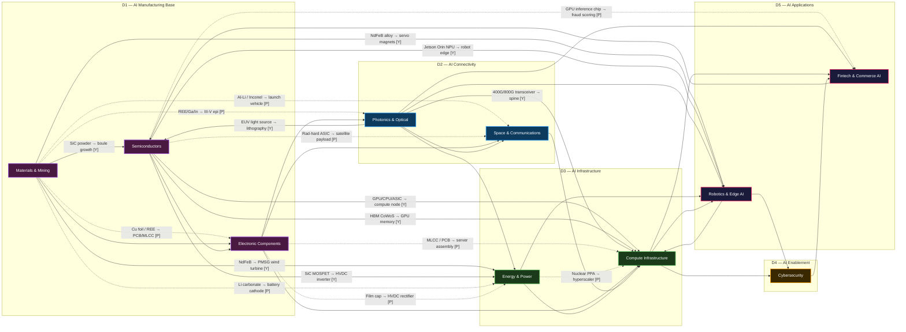

# AI Ecosystem — Dependency Graph
*Generated 2026-05-24 from `Ecosystem Interrelationships.md` · 10 sectors · 31 unique cross-sector edges · 9 hard chokepoints*

Read this diagram bottom-to-top: physical constraints at D1 propagate upward; demand signals at D5 pull downward.

**Edge legend:**
- 🔴 Solid red arrow — hard chokepoint (Y): few producers, no near-term substitute
- 🟡 Dashed yellow arrow — partial chokepoint: geographic concentration or qualification barrier
- ⚫ Thin grey arrow — distributed / no structural bottleneck
- ↩ Return arrow — demand signal (no physical product crosses)

---

## Chokepoint Register

All hard-chokepoint edges (Chokepoint = Y), sorted by upstream dimension.

| # | From Sector | To Sector | Product / Process | Notes |
|---|-------------|-----------|-------------------|-------|
| 1 | Materials & Mining | Semiconductors | SiC powder → 4H-SiC boule growth | SiC substrate growth is slow, defect-sensitive; few suppliers |
| 2 | Materials & Mining | Robotics & Edge AI | NdFeB alloy → sintered permanent magnet → servo motor | China controls ~90% of NdFeB alloy; no western commercial-scale alt |
| 3 | Materials & Mining | Energy & Power | NdFeB → PMSG rotor → direct-drive wind turbine | ~1 tonne NdFeB per MW offshore; same China dependency |
| 4 | Semiconductors | Energy & Power | SiC MOSFET → HVDC rectifier / UPS H-bridge | Si IGBT cannot switch 800V at required frequency; hard technology gate |
| 5 | Semiconductors | Compute Infrastructure | GPU / CPU / ASIC → compute node; HBM CoWoS → GPU memory | NVDA H/B-series allocation + TSMC CoWoS capacity jointly gate server builds |
| 6 | Semiconductors | Robotics & Edge AI | Nvidia Jetson Orin / Ambarella CV3 NPU → robot edge module | Jetson Orin allocation is a gating item for humanoid and AMR production |
| 7 | Photonics & Optical | Semiconductors | EUV light source (CO2 laser-driven Sn plasma) → ASML scanner | Single integrated supplier (Cymer, owned by ASML); no alternate source |
| 8 | Photonics & Optical | Compute Infrastructure | 400G / 800G / 1.6T optical transceiver → spine switch port | CPO transition pending; current pluggable supply is concentrated |
| 9 | Electronic Components | Semiconductors | ABF (Ajinomoto build-up film) substrate → flip-chip BGA / CoWoS | ABF film: Ajinomoto sole-source (food company, ~2% rev); not investable |

---

## Sector Coverage

| Dimension | Sector | Inbound Edges | Outbound Edges |
|-----------|--------|---------------|----------------|
| D1 | Materials & Mining | 0 | 8 |
| D1 | Semiconductors | 3 | 6 |
| D1 | Electronic Components | 3 | 5 |
| D2 | Photonics & Optical | 1 | 6 |
| D2 | Space & Communications | 3 | 2 |
| D3 | Compute Infrastructure | 9 | 4 |
| D3 | Energy & Power | 5 | 2 |
| D4 | Cybersecurity | 2 | 1 |
| D5 | Robotics & Edge AI | 4 | 2 |
| D5 | Fintech & Commerce AI | 4 | 1 |

*Materials & Mining has no inbound edges — it is the physical root of the stack.*
*Cybersecurity and Fintech & Commerce AI are fully downstream — they consume but do not gate upstream production.*
